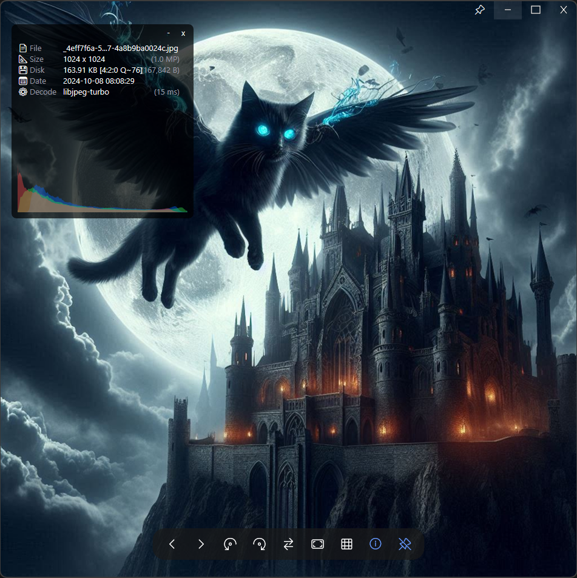

# ⚡ QuickView 2.0

### The Rebirth: Built for Speed, Engineered for Geeks.

    <strong>Direct2D Rendering</strong> • 
    <strong>AVX2/SIMD Optimized</strong> • 
    <strong>Dynamic Island UI</strong>

    
    
    

    <a href="https://github.com/justnullname/QuickView/releases"><b>📥 Download Latest Release</b></a> • 
    <a href="https://github.com/justnullname/QuickView/issues">Report Bug</a> • 
    <a href="https://github.com/justnullname/QuickView/issues">Request Feature</a>

---

## 💥 2.0 Preview: The Rebirth

**QuickView 2.0 represents a complete break from the past.**

This is not a simple iteration. It is a ground-up rewrite based on **Modern C++ (C++23)** and **Direct2D**. We have discarded the legacy GDI rendering baggage and integrated the industry's most cutting-edge decoding technologies (Google Wuffs, TurboJPEG v3, dav1d) with one goal in mind: **To build the fastest, most hardcore image viewer on the Windows platform.**

---

## 🚀 Key Features

### 🏎️ Extreme Performance Engine

> *"Speed is a feature."* We squeeze every ounce of performance out of your hardware.

    
     
    <em>Figure: 18.6MB RAM usage while rendering high-res content with Real-time Histogram.</em>

 

* **Direct2D Pipeline:** Fully GPU-accelerated. Panning, zooming, and rendering on 4K high-refresh displays run at a silky smooth **60fps+**.
* **Dual-Lane Scheduling:** Unique "Fast/Slow" thread pools ensure that loading massive RAW files in the background **never** blocks UI responsiveness.
* **Instant Preview:** For RAW (ARW, CR2, DNG...), HEIC, and PSD, we extract embedded preview streams for **zero-latency** opening of 200MB+ files.

### 🏝️ Dynamic Island Toolbar (New!)

*A UI that breathes with you.*

* **Immersive Interaction:** The toolbar floats elegantly at the bottom, mimicking the "Dynamic Island" aesthetic.
* **Hover-Reactive:** It remains invisible to maximize viewing area and seamlessly expands when your mouse approaches the bottom edge.
* **Geek Tools:** Instant access to Format Repair, RAW Toggle, and Exif data without cluttering the screen.

### 🖼️ HUD Photo Wall

*Browse visually, not just sequentially.*

    
     
    <em>Figure: HUD Photo Wall.</em>

* **"T" to Toggle:** Press `T` to summon the Photo Wall overlay in a Heads-Up Display style.
* **Virtualization:** Effortlessly handles folders with **10,000+ images**. We only render what is currently visible on screen.
* **Smart Caching:** Dual-layer RAM (L1) + VRAM (L2) architecture with strict memory capping.

### 📊 Geek Visualization

*Don't just view the image; understand the data.*

* **Real-time RGB Histogram:** Translucent waveform overlay for exposure analysis.
* **Reverse Q-Factor:** Algorithmically estimates the original JPEG quality (e.g., `Q~98`), seeing through "100% Quality" saves.
* **Chroma Subsampling:** Instantly identify **4:4:4** (Lossless/Design) vs **4:2:0** (Compressed).

---

## ⚙️ The Engine Room: Format Support

QuickView 2.0 doesn't just "open" images; it uses the fastest, most secure libraries available for each format.

| Category | Format | Backend Engine | Why it rocks (Architecture) |
| :--- | :--- | :--- | :--- |
| **Standard** | **JPEG** | **libjpeg-turbo v3** | AVX2 SIMD acceleration. The king of decompression speed. |
| | **PNG** | **Google Wuffs** | Memory-safe, outperforms libpng, handles massive dimensions. |
| | **GIF** | **Google Wuffs** | Extremely low CPU usage for playback (Better than WIC). |
| | **WebP** | **libwebp** | Google's official library. Supports Lossless, Animation, & Alpha. |
| | **BMP / TGA**| **Google Wuffs** | Replaces WIC for robust handling of malformed files. |
| **Modern** | **AVIF** | **libavif + dav1d** | Assembly-level AV1 decoding. Opens AVIFs instantly. |
| | **JXL** | **libjxl + highway** | Next-gen JPEG XL standard with multi-threaded decoding. |
| **Pro / RAW**| **RAW** | **LibRaw** | Prioritizes "Instant Preview" extraction for speed. |
| | **EXR** | **TinyEXR** | Lightweight, industrial-grade OpenEXR support. |
| | **HDR** | **stb_image** | Radiance HDR format support. |
| | **PSD** | **stb_image** | Reads composite preview layer for instant viewing. |
| **Vector** | **SVG** | **NanoSVG** | Rasterizes vector to bitmap for infinite scaling. |
| **System** | **HEIC** | **Windows WIC** | Hardware accelerated (Requires HEIF Extension). |

---

## ⌨️ Shortcuts

Master these shortcuts to navigate QuickView at the speed of thought:

### 👁️ Viewing & Navigation
| Key | Action | Description |
| :--- | :--- | :--- |
| **`T`** | **Photo Wall** | Toggle the HUD Gallery overlay. |
| **`1`** / **`Z`** | **100% View** | Pixel-perfect inspection (Actual Size). |
| **`0`** / **`F`** | **Fit to Screen** | Fit the entire image to the screen. |
| **`Enter`** / **`F11`** | **Fullscreen** | Toggle immersive fullscreen mode. |
| **`Esc`** | **Exit** | Exit fullscreen or close the application. |
| **`Tab`** | **Lite Info** | Cycle through basic OSD overlays. |
| **`I`** | **Full Info** | Toggle the detailed EXIF/Histogram panel. |
| **`Ctrl + T`** | **Always on Top** | Pin the window to the foreground. |

### 🔄 Transform & Edit
| Key | Action | Description |
| :--- | :--- | :--- |
| **`R`** | **Rotate CW** | Rotate 90° Clockwise. |
| **`Shift + R`** | **Rotate CCW** | Rotate 90° Counter-Clockwise. |
| **`H`** | **Flip Horizontal** | Mirror the image horizontally. |
| **`V`** | **Flip Vertical** | Mirror the image vertically. |
| **`E`** | **Edit** | Open image in default external editor. |

### 📁 File Operations
| Key | Action | Description |
| :--- | :--- | :--- |
| **`O`** / **`Ctrl + O`** | **Open File** | Open file dialog. |
| **`F2`** | **Rename** | Rename the current file on disk. |
| **`Del`** | **Delete** | Move current file to Recycle Bin. |
| **`Ctrl + C`** | **Copy Image** | Copy image data to Clipboard. |
| **`Ctrl + Alt + C`** | **Copy Path** | Copy full file path text. |
| **`Ctrl + P`** | **Print** | Open system print dialog. |

---

## 📥 Download & Install

**QuickView is Portable.** No installers, no registry bloat.

1. Go to the [**Releases Page**](https://github.com/justnullname/QuickView/releases).
2. Download the latest `QuickView_2.0_Preview_x64.zip`.
3. Unzip and run `QuickView.exe`.

---

## 🗺️ Roadmap

We are moving fast. Here is our current progress:

- [x] **Core Engine 2.0** (D2D, Wuffs, TurboJPEG)
- [x] **HUD Photo Wall** (Virtualization, Smart Cache)
- [x] **Geek Panel** (Histogram, Q-Estimator)
- [x] **Dynamic Island Toolbar** (Hover-reactive UI)
- [x] **Full Format Support** (SVG, EXR, PSD, JXL, AVIF)
- [ ] **Visual Settings UI** (Replacing manual .ini editing)
- [ ] **Gif/WebP Frame Inspector** (Frame-by-frame analysis)

---

## ⚖️ License & Credits

This project is licensed under the **GPL-2.0 License**.
QuickView stands on the shoulders of giants. We salute **David Kleiner** (original JPEGView) and the open-source community behind **LibRaw, LibJpeg-Turbo, Google Wuffs, dav1d, and TinyEXR**.