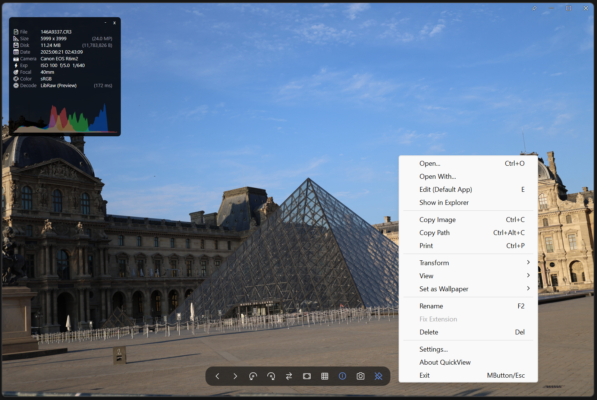
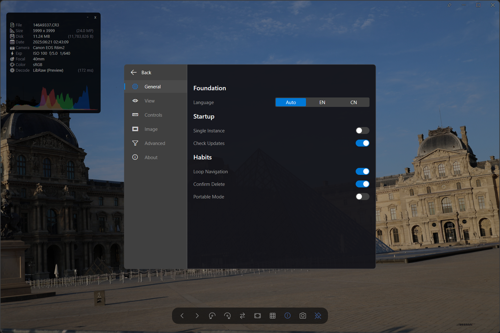
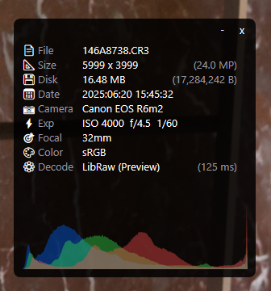
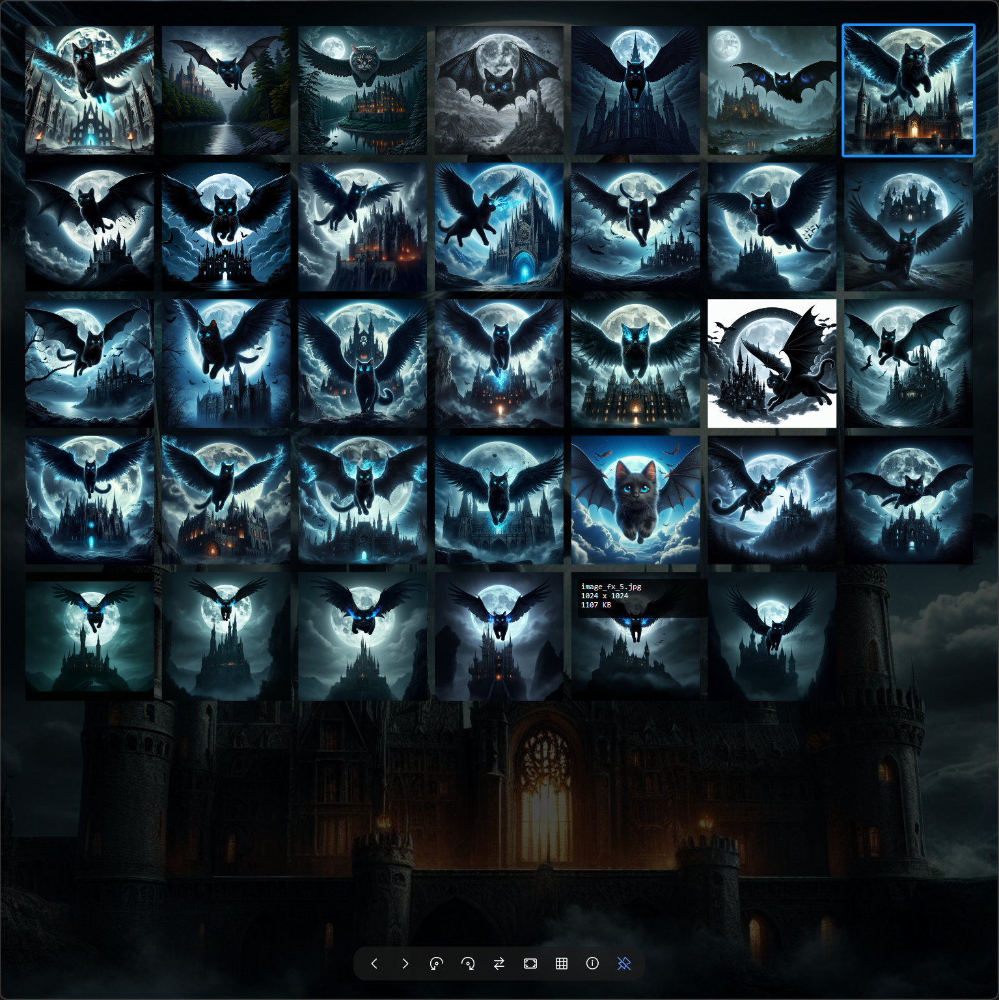

  

# ⚡ QuickView

### Windows 平台的高性能图像查看器。
**为速度而生。为极客打造。**

    <strong>Direct2D Native</strong> • 
    <strong>Modern C++23</strong> • 
    <strong>动态调度架构 (Dynamic Scheduling)</strong> • 
    <strong>绿色便携</strong>

    
    
    
    

<h3>
    <a href="https://github.com/justnullname/QuickView/releases/latest">📥 下载最新版</a>
     • 
    <a href="https://github.com/justnullname/QuickView/tree/main/ScreenShot">📸 截图预览</a>
     • 
    <a href="https://github.com/justnullname/QuickView/issues">🐛 报告 Bug</a>
</h3>

---

## 🚀 简介

**QuickView** 是目前 Windows 平台上最快的图像查看器之一。我们专注于提供极致的 **浏览体验**——把繁重的编辑工作留给 Photoshop 这样的专业工具。

使用 **Direct2D** 和 **C++23** 从头重写，QuickView 摒弃了传统的 GDI 渲染，采用了游戏级的视觉架构。它的启动速度和渲染性能足以媲美甚至超越闭源商业软件，旨在以零延迟处理从微小图标到巨型 8K RAW 照片的所有内容。

🌐 **多语言支持:** English, 简体中文, 繁體中文, 日本語, Deutsch, Español, Русский

### 📂 支持格式
QuickView 支持几乎所有现代和专业图像格式：

* **经典格式：** `JPG`, `JPEG`, `PNG`, `BMP`, `GIF`, `TIF`, `TIFF`, `ICO`
* **现代/Web格式：** `WEBP`, `AVIF`, `HEIC`, `HEIF`, `SVG`, `SVGZ`, `JXL`
* **专业/HDR：** `EXR`, `HDR`, `PIC`, `PSD`, `TGA`, `PCX`, `QOI`, `WBMP`, `PAM`, `PBM`, `PGM`, `PPM`, `WDP`, `HDP`
* **RAW (LibRaw)：** `ARW`, `CR2`, `CR3`, `DNG`, `NEF`, `ORF`, `RAF`, `RW2`, `SRW`, `X3F`, `MRW`, `MOS`, `KDC`, `DCR`, `SR2`, `PEF`, `ERF`, `3FR`, `MEF`, `NRW`, `RAW`

---

# QuickView v4.2.5 - Comparison & Precision Master
**发布日期**: 2026-03-22

### 🚀 核心架构："泰坦引擎 (Titan System)"
- **十亿像素瓦片化 (Gigapixel Tiling)**：全新的 Titan 渲染管线可将巨幅图像动态切片为 LOD（多细节层次）瓦片，让过去会导致 OOM（内存溢出）崩溃的超大图像也能以 60fps 超顺滑平移。
- **智能预取调度 (Smart Pull & Prefetch)**：彻底实现了内存智能流式传输。QuickView 仅解码和渲染当前屏幕可见的瓦片，并可预测平移方向以预读相邻区块。
- **MMF 零拷贝解码 (Direct-to-MMF)**：基于内存映射文件 (Memory-Mapped File) 的零拷贝策略，直接将超大源图像传输到渲染合成引擎，大幅降低峰值内存占用。

### ✨ 格式拓展与深度缓存
-   **原生 JPEG XL (JXL)**：在并行工作线程池的支持下，全面且高度优化地支持下一代 JXL 格式图像。
-   **专业设计格式**：新增对 Photoshop 大型文档格式 (PSB) 的支持，并实现 PSD/PSB 的极限秒开预览提取。
-   **系统级画廊融合**：照片墙（快捷键 `T`）现在直接接入 Windows Explorer（资源管理器）的外壳缩略图缓存，让包含数千张照片的文件夹也能瞬间完成索引显示。

### 💎 PerMonitorV2 与极致体验
-   **原生高 DPI 缩放**：界面渲染全面摆脱传统的 Windows DWM 缩放。我们现在支持原生的 Direct2D UI 显式缩放，并提供精确的手动比例调整（100%-250%），完美适配多显示器混合 DPI 场景。
-   **自动全屏模式 (Always Fullscreen)**：新增备受期待的启动选项，可强制以独占全屏模式自动打开图像（支持 `关闭` / `仅大图` / `所有` 模式），并配有智能退出逻辑。
-   **AVX-512 SIMD 缩放**：核心的二次线性插值缩放算法已经使用最前沿的 AVX2/AVX-512 指令集进行了循环展开与重写，带来极致的极速缩放体验。

### 🔍 极客比对模式 (Compare Mode)
- **专业级基准比对**：支持多图同时缩放、平移和旋转同步。
- **分析型 HUD**：实时显示 RGB 包络图/双曲线直方图，以及图像熵、锐度等专业质量指标。
- **智能分割交互**：内置交互式分割线，自动标注各项比对指标的“优胜者”。

---

## ✨ 核心功能

### 1. 🏎️ 极致性能
> *"速度即功能。"*

QuickView 利用 **多线程解码** 技术处理 **JXL** 和 **AVIF** 等现代格式，在 8 核 CPU 上相比标准查看器加载速度提升高达 **6倍**。
* **零延迟预览：** 针对巨型 RAW (ARW, CR2) 和 PSD 文件的智能提取技术。
* **调试 HUD：** 按 `F12` 查看实时性能指标（解码时间、渲染时间、内存使用）。*(首次使用请在 **设置 > 高级** 中开启调试模式)*
   

### 2. 🎛️ 可视化控制中心
> *告别手动编辑 .ini 文件。*

完全硬件加速的 **设置仪表板**。
* **精细控制：** 调整鼠标行为（平移 vs 拖拽）、缩放灵敏度和循环规则。
* **视觉个性化：** 实时调整 UI 透明度和背景网格。
* **便携模式：** 一键切换配置存储位置（AppData/系统 还是 程序文件夹/USB）。

### 3. 🔄 智能更新
> *让软件时刻保持最新。*

QuickView 会自动检测新版本，并支持一键静默更新。无需打开浏览器，即刻体验最新功能。

### 4. 📊 极客可视化
> *不只是看图；更要洞察数据。*

  
  

* **实时 RGB 直方图：** 半透明波形叠加。
* **重构的元数据架构：** 更快、更准确的 EXIF/元数据解析。
* **HUD 照片墙：** 按 `T` 召唤高性能画廊叠加层，能够以 60fps 虚拟化滚动 10,000+ 张图片。
* **智能后缀修正：** 自动检测并修复错误的扩展名（如将 PNG 误存为 JPG）。
* **一键 RAW 渲染：** 极速切换 RAW 文件的“内嵌预览”与“完整解码”模式。
* **专业色彩分析：** 实时显示 **色彩空间** (sRGB/P3/Rec.2020)、**色彩模式** (YCC/RGB/CMYK) 和 **压缩质量** (Q-Factor)。

### 5. 🔍 极致视觉对比
> *"以前所未有的精度并行比对。"*

QuickView 提供了专为深度视觉分析打造的 **双图比对模式 (Compare Mode)**。
* **双路同步：** 两个窗格之间的缩放、平移和旋转完全同步，支持毫米级的精细核对。
* **极客 HUD：** 实时显示 **RGB 包络直方图** 和图像质量指标（熵、锐度），帮助您快速识别更优质的样张。
* **智能分割线：** 带有智能透明度的分割线，自动标注每个对比维度的“优胜者”。
   
   

---

## ⚙️ 引擎室

我们不使用通用编解码器。我们为每种格式选用 **最先进 (State-of-the-Art)** 的库。

| 格式 | 后端引擎 | 为什么它很棒 (架构) |
| :--- | :--- | :--- |
| **JPEG** | **libjpeg-turbo v3** | **AVX2 SIMD**。解压速度之王。 |
| **PNG / QOI** | **Google Wuffs** | **内存安全**。超越 libpng，轻松处理超大尺寸。 |
| **JXL** | **libjxl + threads** | **并行化**。高分辨率 JPEG XL 即时解码。 |
| **AVIF** | **dav1d + threads** | **汇编优化** 的 AV1 解码。 |
| **SVG** | **Direct2D Native** | **硬件加速**。无限无损缩放。 |
| **RAW** | **LibRaw** | 针对“即时预览”提取进行了优化。 |
| **EXR** | **TinyEXR** | 轻量级、工业级 OpenEXR 支持。 |
| **HEIC / TIFF**| **Windows WIC** | 硬件加速（需要系统扩展）。 |

---

## ⌨️ 快捷键与帮助

> *随时按 `F1` 呼出交互式快捷键指南。*

  

🗺️ 开发计划 (Roadmap)
我们因为持续进化而卓越。以下是当前正在开发的功能：

- **动画支持 (Animation Support):** GIF/WebP/APNG 完整播放支持。
- **帧查看器 (Frame Inspector):** 暂停并逐帧分析动画。
- **色彩管理 (CMS):** 完整的 ICC 配置文件支持。
- **临摹模式 (Tracing Mode):** 半透明的薄膜覆盖模式，适用于设计师参考图及临摹描绘。

---

## 💻 系统要求

| 组件 | 最低要求 | 备注 |
| :--- | :--- | :--- |
| **操作系统** | Windows 10 (1511+) | 需要 DirectComposition Visual3 支持 |
| **处理器** | Intel Haswell / AMD Ryzen | **必须支持 AVX2** (编译时硬性要求) |
| **显卡** | DirectX 10 兼容 | 2008 年后的任意显卡均可 |
| **内存** | 4 GB+ | 推荐用于大型图片 |

> ⚠️ **重要提示:** QuickView 使用 `/arch:AVX2` 编译以获得最佳性能。它**无法在不支持 AVX2 的 CPU 上运行**（如 Intel Sandy Bridge、AMD FX 系列）。

---

## 📥 安装

**QuickView 是 100% 绿色便携的。**

1.  前往 [**Releases**](https://github.com/justnullname/QuickView/releases).
2.  下载 `QuickView.zip`.
3.  解压到任意位置并运行 `QuickView.exe`.
4.  *(可选)* 使用应用内设置将其注册为默认查看器。

---

## ⚖️ 致谢

> [!NOTE]
> **开发者寄语**
>
> 我利用业余时间维护 QuickView，只因我相信 Windows 值得拥有一个更快、更纯粹的看图工具。
> 我没有推广预算，也没有团队。如果 QuickView 对您有所帮助，在 GitHub 上点一颗星或分享给朋友，就是对我最大的支持。

**QuickView** 站在巨人的肩膀上。
基于 **GPL-3.0** 许可。
特别感谢 **David Kleiner** (JPEGView 原作者) 以及 **LibRaw, Google Wuffs, dav1d, 和 libjxl** 的维护者们。
